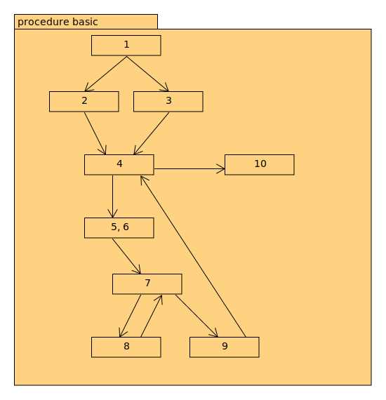

# Milestone 2 tests descriptions

## Calls queries

These test cases test the calls query and callsT queries.
The general graph of the calls source is as follows

`Calls_source.txt`


The tests:
General queries:
```
Calls(p, q)

Calls(p, "white")

Calls("white", q)
```
A similar testing pattern is done for CallsT.

## Next queries

The CFGs of the programs for the test cases:



